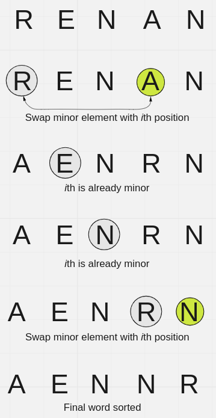

# Algorithms
Authors: Robert Sedgewick and Kevin Wayne

## 2 - Sorting
### Selection Sort
Search for minor item in the array swap with *i*th position

Properties:
- Swap is linear (N -1)
- Elements to the left of the *i*th position are sorted, to the right need sorting
- Worst case is a reverse array like "9,8,7,6,5,4,3,2,1,0"
- Max number of swaps occur when you have an array that the second position forwared are sorted and the first item is higher than all other items. "9,0,1,2,3,4,5,6,7,8".

